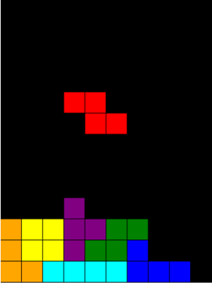
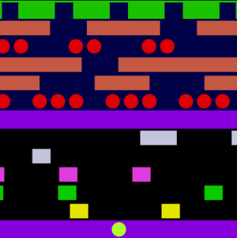
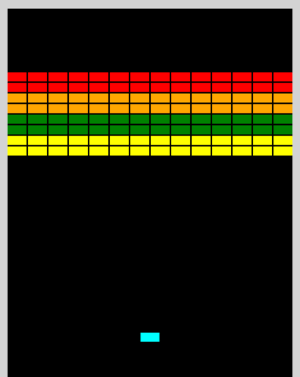

# Containerizing Applications with Oracle OKE (Container Engine for Kubernetes)

This is the Oracle Cloud member of the **Kubernetes In the Cloud** series — a port of [aws-k8s](https://github.com/mamonaco1973/aws-k8s), which built the same workloads on Amazon EKS.

This is a **fully automated deployment** of containerized microservices and web apps with **Oracle Container Engine for Kubernetes (OKE)** — powered by Terraform and shell scripting.

We'll build and deploy:

- **A document database-backed microservice** using:
  - **OCI NoSQL Database** for fast, serverless document storage.

- **A Docker container** for the Flask microservice, optimized for deployment to **OKE**.

- **Additional standalone Docker containers** that run classic JavaScript games like **[Tetris](https://gist.github.com/straker/3c98304f8a6a9174efd8292800891ea1)**, **[Frogger](https://gist.github.com/straker/82a4368849cbd441b05bd6a044f2b2d3)**, and **[Breakout](https://gist.github.com/straker/98a2aed6a7686d26c04810f08bfaf66b)**.

- **Cloud-native container registry workflows**, pushing all images to:
  - **OCI Container Registry (OCIR)**.

- **Kubernetes workloads on OKE**, managing containerized applications at scale.

- **Kubernetes manifests** including **Deployments**, **Services**, and **Ingress** resources.

- **NGINX as a unified Ingress controller**, exposing all services and games behind a single **OCI Load Balancer**.

---

## What Changed From the AWS Build

The Kubernetes side is almost untouched — the same Deployments, Services, Ingresses and HPA. Nearly all of the difference is in what sits underneath.

| Concern | AWS | OCI |
|---|---|---|
| Registry | ECR, addressed by account ID | OCIR, addressed by object storage namespace |
| Cluster | EKS | OKE, `ENHANCED_CLUSTER` |
| Database | DynamoDB | OCI NoSQL Database |
| Pod → database auth | IRSA (OIDC provider + IAM role) | OKE workload identity |
| Load balancer | AWS Load Balancer Controller (Helm chart + IAM policy) | Built into OKE — nothing to install |
| Image pull | Node instance role, no secret needed | `imagePullSecrets` required |
| Subnets | 2 public + 2 private, one pair per AZ | 3 regional subnets, split by role |
| Node autoscaling target | Discovered from EC2 tags | Node pool OCID, named explicitly |

Four of these are worth expanding on.

### The load balancer controller is gone

The AWS build installed the **AWS Load Balancer Controller** so Kubernetes could create an ALB at all: a Helm chart, a service account, an IRSA role, and a roughly two-hundred-line IAM policy enumerating every `elasticloadbalancing:*` and `ec2:*` action it might need.

OKE ships the **OCI cloud controller manager** inside the cluster. A `Service` of type `LoadBalancer` provisions an OCI Load Balancer with no controller to install and no policy to write. The entire `alb.tf` file and its template were deleted with nothing put in their place.

### IRSA became workload identity

IRSA on EKS required an OIDC identity provider resource, a TLS certificate data source to scrape the issuer's thumbprint, an assumable-role module, an IAM role, a policy, and a service account annotated with the role ARN.

The OCI equivalent is one policy statement:

```
Allow any-user to manage nosql-rows in compartment id <ocid> where all {
  request.principal.type = 'workload',
  request.principal.namespace = 'default',
  request.principal.service_account = 'nosql-access-sa',
  request.principal.cluster_id = '<cluster ocid>'
}
```

The service account itself needs no annotation. In the pod, `get_oke_workload_identity_resource_principal_signer()` replaces the ambient IAM credential boto3 was picking up.

This is why the cluster is created as an `ENHANCED_CLUSTER` — a basic cluster cannot issue workload principal tokens at all.

### Four subnets became three

AWS subnets are **zonal**, so the original build ran two public and two private subnets — one pair per availability zone — because an ALB needs a subnet in at least two zones.

OCI subnets are **regional**. A single subnet already spans every availability domain, and the load balancer distributes itself. The AZ pairing has nothing to do, so the four subnets collapse to three split by role instead: the Kubernetes API endpoint, the load balancers, and the worker nodes.

### The autoscaler has to be told what to scale

The AWS cluster autoscaler discovered its scaling targets by reading EC2 tags, so tagging a node group was enough to enrol it. The OCI provider has no tag discovery: each node pool is passed explicitly as `min:max:ocid`, and a pool that is not listed is invisible to it.

Only the flask pool is registered, on purpose. The game pool never scales.

---

## Architecture

The solution is a fully managed **OKE cluster**, deployed to whichever region
your OCI CLI is configured for. Nothing in it is region-specific.

It includes:

- A managed **control plane** provided by Oracle
- Two distinct **node pools**:
  - `flask-nodes` for the Flask microservice, autoscaling from 1 to 4
  - `game-nodes` for the JavaScript games, fixed at 1

The solution integrates with:

- **OCI VCN** for networking — one VCN, three regional subnets
- **OCIR** for storing and managing Docker container images
- **OCI NoSQL Database** for document storage
- An **OCI Load Balancer**, created by the cluster itself
- An **NGINX Ingress Controller** routing to individual services

All infrastructure is defined using **Terraform**; application deployment is performed with `kubectl`.

> **Note:** the diagrams in `./diagrams/` still show the AWS topology and have not been redrawn for this port.

---

## Prerequisites

* [An Oracle Cloud Account](https://cloud.oracle.com/)
* [Install the OCI CLI](https://docs.oracle.com/en-us/iaas/Content/API/SDKDocs/cliinstall.htm) and run `oci setup config`
* [Install Latest Terraform](https://developer.hashicorp.com/terraform/install)
* [Install kubectl](https://kubernetes.io/docs/tasks/tools/)
* [Install Docker](https://docs.docker.com/engine/install/)
* `jq` on your PATH

The OCI CLI is a hard requirement rather than a convenience: Terraform's `kubernetes` and `helm` providers get their bearer token by shelling out to `oci ce cluster generate-token`, so the apply itself fails without it.

## Download this Repository

```bash
git clone https://github.com/mamonaco1973/oci-k8s.git
cd oci-k8s
```

## Build the Code

Run [check_env](check_env.sh) then run [apply](apply.sh).

```bash
~/oci-k8s$ ./apply.sh
NOTE: Running environment validation.
NOTE: Validating required commands in PATH.
NOTE: Found required command: oci
NOTE: Found required command: terraform
NOTE: Found required command: docker
NOTE: Found required command: kubectl
NOTE: Found required command: jq
NOTE: All required commands are available.
NOTE: Checking OCI CLI connection.
NOTE: OCI CLI authentication successful.
NOTE: Tenancy home region is us-ashburn-1.
NOTE: Object storage namespace is axxxxxxxxxxx.
NOTE: Environment validation passed.
NOTE: Building the VCN and OCIR repositories.
[...]
```

No environment variables are required — everything is derived from `~/.oci/config`. Two optional overrides:

| Variable | Default |
|---|---|
| `OCI_COMPARTMENT_ID` | tenancy root |
| `OCI_REGION` | the `region` in `~/.oci/config` |

On the first run the script creates an **OCIR auth token** and caches it in `~/.oci/ocir_token`. A token is readable only at creation time, so it cannot be recovered later — delete the file to force a new one. OCI allows two per user, so an old token may need removing in the Console first.

### Build Process Overview

The build process is organized into four phases:

#### 1. Provision OCIR Repositories and the VCN
- Creates **OCIR** repositories for storing container images.
- Sets up the **VCN**, subnets and gateways required for the cluster.

#### 2. Build and Push Docker Images
- Builds Docker images for the **Flask microservice** and three **JavaScript game apps**.
- Pushes all images to **OCIR**.

#### 3. Provision the OKE Cluster
- Deploys the cluster with two node pools:
  - `flask-nodes` for the Flask microservice
  - `game-nodes` for the game containers
- Creates the NoSQL table, the workload identity policy and the add-ons.

This phase takes roughly 15 minutes.

#### 4. Deploy Applications Using `kubectl`
- Configures `kubectl` with `oci ce cluster create-kubeconfig`.
- Applies:
  - [flask-app.yaml](./03-oke/yaml/flask-app.yaml.tmpl) for the microservice
  - [games.yaml](./03-oke/yaml/games.yaml.tmpl) for the game containers

---

## Service Endpoint Summary

`validate.sh` prints the load balancer address when the deploy finishes.

### `/flask-app/api/gtg` (GET)
- **Purpose**: Health check.
- **Response**:
  - `{"connected": "true", "hostname": <pod_ip>}` (if `details` query parameter is provided).
  - 200 OK with no body otherwise.

### `/flask-app/api/candidate/<name>` (GET)
- **Purpose**: Retrieve a candidate by name.
- **Response**:
  - Candidate details (JSON) with status `200`.
  - `"Not Found"` with status `404` if no candidate is found.

### `/flask-app/api/candidate/<name>` (POST)
- **Purpose**: Add or update a candidate by name.
- **Response**:
  - `{"CandidateName": <name>}` with status `200`.
  - `"Unable to update"` with status `500` on failure.

### `/flask-app/api/candidates` (GET)
- **Purpose**: Retrieve all candidates.
- **Response**:
  - List of candidates (JSON) with status `200`.
  - `"Not Found"` with status `404` if no candidates exist.

### `/games/tetris` (GET)
 - **Purpose**: Loads the JavaScript Tetris game in a web browser.

      

### `/games/frogger` (GET)
 - **Purpose**: Loads the JavaScript Frogger game in a web browser.

      

### `/games/breakout` (GET)
 - **Purpose**: Loads the JavaScript Breakout game in a web browser.

      

---

## Kubernetes Cluster Validation and Autoscaling Test

### Step 1: Validate Pod Deployments

```bash
kubectl get pods
kubectl get pods -n games
```

### Step 2: Check Deployment Health

```bash
kubectl get deployments
kubectl get deployments -n games
```

### Step 3: Confirm Ingress Setup

```bash
kubectl get ingress
kubectl get ingress -n games
```

The `ADDRESS` column shows an **IP address**, not a hostname. An OCI Load Balancer has no DNS name of its own.

### Step 4: Check Node Availability

```bash
kubectl get nodes
```

### Step 5: Simulate Load with a Stress Test

```bash
kubectl apply -f stress.yaml
```

Wait about 5 minutes for the autoscaler to respond, then:

```bash
kubectl get nodes
```

### Step 6: Clean Up the Load Generator

```bash
kubectl delete -f stress.yaml
```

Wait about 5 minutes for the cluster to scale back down, then check again:

```bash
kubectl get nodes
```

---

## Teardown

```bash
./destroy.sh
```

The order matters. The OCI Load Balancer is created by the in-cluster cloud controller manager, not by Terraform, so Terraform does not know it exists. `destroy.sh` removes the ingress release first so the controller can delete its own load balancer while it is still running — otherwise the balancer is stranded and blocks the subnet, and therefore the VCN, from being deleted.

---

## Troubleshooting

| Symptom | Fix |
|---|---|
| Flask pod gets a 404 from NoSQL on every call | Workload identity is not matching. Check that the pod's service account, its namespace and the cluster OCID all match the policy in [03-oke/iam.tf](./03-oke/iam.tf). A mismatch resolves to no groups and reads as 404, not 403 |
| Pods stuck in `ImagePullBackOff` | The `ocir-secret` is missing from that namespace, or the cached auth token in `~/.oci/ocir_token` was revoked |
| Pods stuck in `Pending` | No node carries the `nodegroup` label the deployment selects on. Check `kubectl get nodes --show-labels` |
| Ingress `ADDRESS` stays empty | The load balancer is still provisioning, or the `lb` subnet was not passed as `service_lb_subnet_ids` on the cluster |
| HPA reports `<unknown>` for CPU | metrics-server is not running or is failing TLS verification against the kubelets — see the `--kubelet-insecure-tls` argument in [03-oke/helm.tf](./03-oke/helm.tf) |
| Autoscaler never adds nodes | The node pool OCID is not in the autoscaler values, or the worker node dynamic group did not exist when the nodes booted. An instance principal caches its group membership at boot — the nodes must be recycled after a group change |
| `terraform destroy` fails on the subnet | A load balancer still exists. Delete the ingress controller's Service and wait for the balancer to disappear before retrying |
| `oci ce cluster generate-token` not found | The OCI CLI is missing from PATH where Terraform runs |
| NoSQL: "Free tables are not available at this region" | `is_auto_reclaimable = true` requests the always-free tier, which not every region offers. It is `false` in [03-oke/nosql.tf](./03-oke/nosql.tf) |
| Node pool 409: "Kubernetes version does not match ... worker node image" | The image match found a version whose number merely starts with yours — 1.33.1 matching 1.33.10. The pattern in [03-oke/oke.tf](./03-oke/oke.tf) is anchored with a trailing hyphen |
| `destroy.sh` fails with "No value for required variable" | You are on an older copy. Both scripts now source [oci-env.sh](./oci-env.sh) — Terraform needs the same variables on destroy as on apply |
